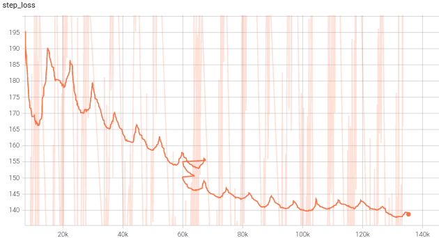

# Deep-Speech_Arabic-dataset

 In this Project, we are trying to use DeepSpeech engine to train our own private Arabic Dataset. The 3 main components of this projects are:
 - Preprocessing (Khaled Osama)
 - Language Model (Omar Khaled)
 - DeepSpeech training (Moustafa Elsayed)

### DeepSpeech Training
DeepSpeech is an online API for easier utiliziation of the DeepSpeech architecture. Here are the training inputs:
- CSV files containing the path of the audio files and the transecription of each utterance
- alphabet.txt containing all the unique characters used in the dataset.
- paths for checkpoints, model, and summary (for tensorboardX).
- optional flags to set hyperparameters.

Here is the training loss on tensorboard with smoothing set to 0.999 as the training had a lot of fluctuations (due to deepSpeech starts with a loss and accumlates with time giving it this periodical shape)

